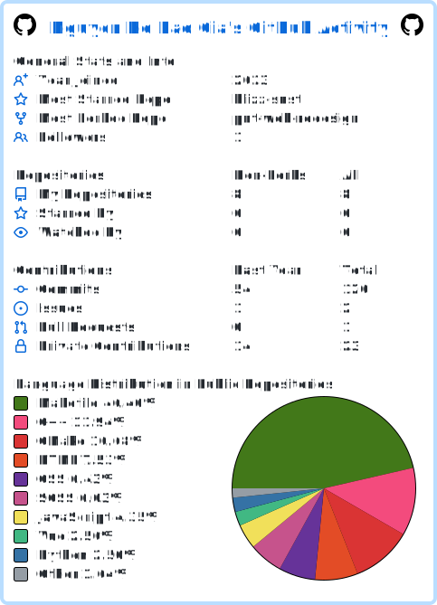

  

  <h1>Gary Nolanson (@SPSTVMCR)</h1>
  <h3>You might also know me as Gia.</h3>

  

    I like to build projects in my free time, whether for school or personal.
  

  

    Sometimes both.
  

   

  

    
      
    
  

   

  

    
    
    
    
    
    
    
    
    
    
    
    
    
    
    
  

   

  

    
    
    
  

